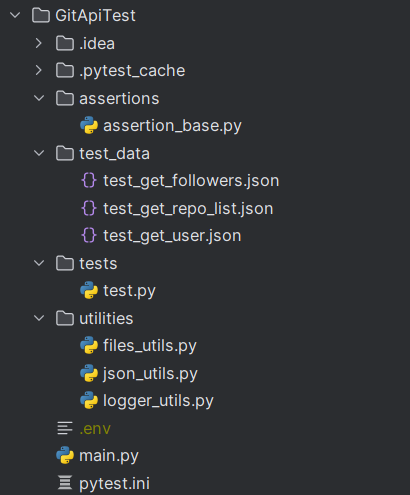

# Лабораторные работы по дисциплине "Управление качеством программных систем"

### Лабораторная 1 - Pytest, GitHub API

Скрины

**структура проекта**

**main.py - запросы к API**

**test.py - тесты запросов**

**пройденные тесты**

### Лабораторная 3 - Создание технической документации
[Ссылка на документ](https://github.com/Redegit/QualityManagement/Лабораторная%203%20(создание%20тестовой%20документации).docx)