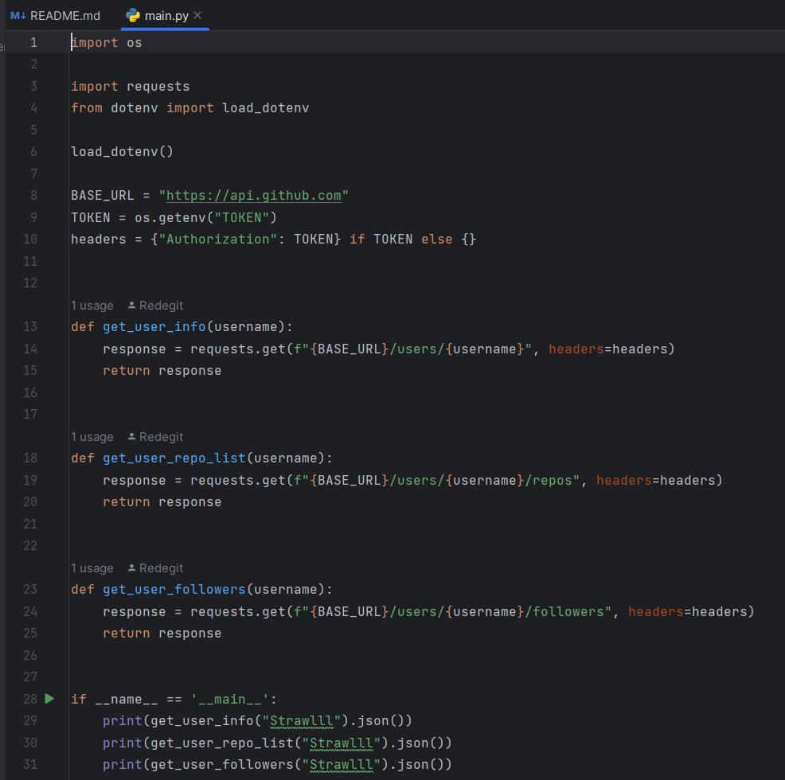

# Лабораторные работы по дисциплине "Управление качеством программных систем"

Лабораторная 1 - Pytest, GitHub API

**структура проекта**

**main.py - запросы к API**

**test.py - тесты запросов**

**пройденные тесты**

