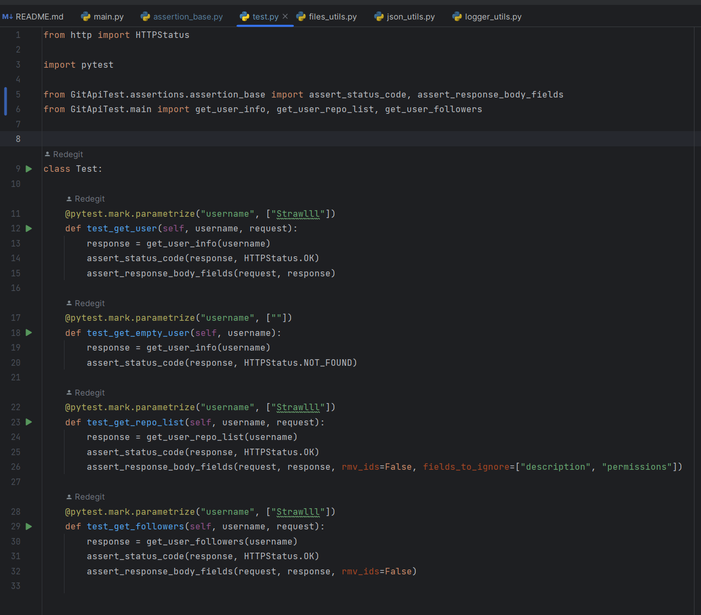

# Лабораторные работы по дисциплине "Управление качеством программных систем"

### Лабораторная 1 - Pytest, GitHub API

Скрины

**структура проекта**

**main.py - запросы к API**

**test.py - тесты запросов**

**пройденные тесты**

### Лабораторная 3 - Создание технической документации
[Ссылка на документ](https://github.com/Redegit/QualityManagement/raw/main/files/%D0%9B%D0%B0%D0%B1%D0%BE%D1%80%D0%B0%D1%82%D0%BE%D1%80%D0%BD%D0%B0%D1%8F%203%20(%D1%81%D0%BE%D0%B7%D0%B4%D0%B0%D0%BD%D0%B8%D0%B5%20%D1%82%D0%B5%D1%81%D1%82%D0%BE%D0%B2%D0%BE%D0%B9%20%D0%B4%D0%BE%D0%BA%D1%83%D0%BC%D0%B5%D0%BD%D1%82%D0%B0%D1%86%D0%B8%D0%B8).docx)

### Лабораторная 4 - Методы тест-дизайна
[Ссылка на документ](https://github.com/Redegit/QualityManagement/raw/main/files/Лабораторная%204%20(методы%20тест-дизайна).docx)
